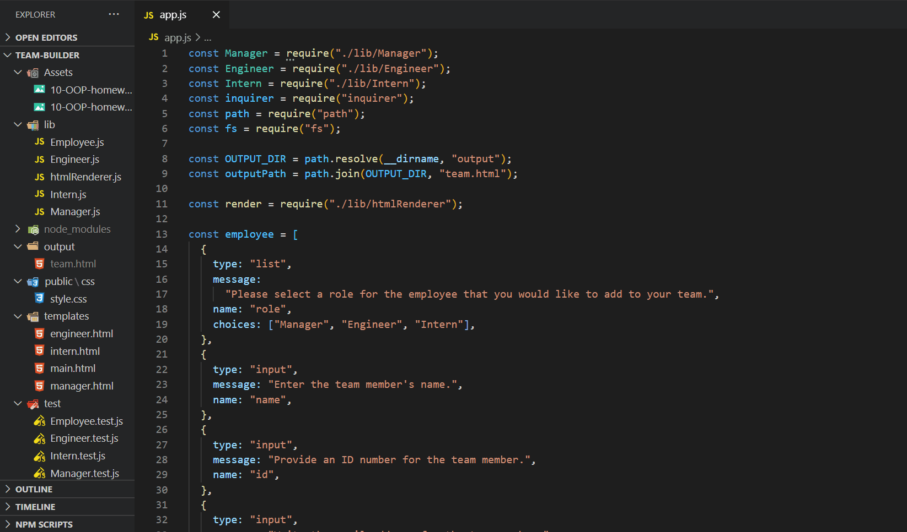

# Team Builder

## Description
    This is a CLI app that generates a web page that displays information about your development team.
    
## Table of Contents 
1. [Installation](#installation)
2. [Usage](#usage)
3. [Technologies](#technologies)
4. [Demo](#demo)
5. [License](#license)
6. [Contributing](#contributing)
7. [Tests](#tests)
8. [Questions](#questions)
    
## Installation
After cloning the repository, you will run the app entirely through your terminal. You must install Node.js with the following dependencies: inquirer, path, and fs. In order to initialize the program in your terminal run the command "node app.js".

## Usage
Answer the prompts to add team members and their data. When you are finished, select "No" or "n" when prompted if you would like to add another member. The app will generate a web page called "team.html" in the output folder with individualized cards containing all the data for your team members on the page. 

## Technologies
Node.js, Bootstrap, JavaScript, HTML, CSS. The README was generated using [readme-generator](https://github.com/rkraeher/readme-generator).

## Demo

## License 
  
Copyright (c) 2020 Rudi Kraeher
    
## Contributing
Send me an email to inquire about contributing. 
    
## Tests
At this time I have no guidelines for testing.
    
## Questions
If you have any questions about the repo you can email me at rudikraeher@gmail.com.  
Visit my [GitHub](https://github.com/rkraeher) to see more of my work.